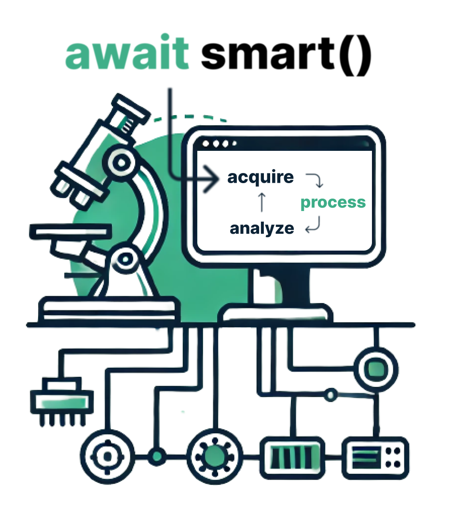

# akuire

[](https://codecov.io/gh/jhnnsrs/akuire)
[](https://pypi.org/project/akuire/)
[](https://pypi.org/project/akuire/)

[](https://pypi.python.org/pypi/akuire/)
[](https://pypi.python.org/pypi/akuire/)

[](./akuire.png)

Akuire is a prototype of (asynchronous) acquisiton engine for smart-microscopy workflows. It was designed during the "Smart Microscopy" hackathon at the [Lund](https://www.lunduniversity.lu.se/) [Bioimaging Center](https://www.bmc.lu.se/). 

The main goal of Akuire is to provide a simple and flexible way to acquire images from a microscope in an abstract way, interfacing with different
microscopy software backbones. Its centered around the idea of composable acquisition events that are either handlable by the hardware directly and therefore optimizable or can be compiled into a list of events that are compatible with the underlying hardware. It currently stands as 
a playground for ideas and concepts, while figuring out ways to abstract and enable modern smart microscopy workflows.


> [!NOTE] Akuire is a playground for ideas and concepts, while figuring out ways to abstract and enable modern smart microscopy workflows. There is already great solutions in this space, all with their own strengths and weaknesses. Akuire is not meant to replace them, but to complement them and provide a different perspective on how to design smart microscopy workflows. If you 


## Features

- **Testable**: Akuire is designed to be a backbone for testing and desinging smart microscopy workflows, allowing you to easily mock hardware and test your acquisition plans, without actually interfacing with the hardware.

- **Hardware Agnostic**: Akuire is designed to be hardware agnostic, allowing you to easily switch between different hardware setups.

- **Optimizable**: Akuire is designed to be optimizable, allowing you to compile acquisition plans into a list of events that are compatible with the underlying hardware.

- **Asynchronous**: Akuire is built internally on top of asyncio, making it easy to write asynchronous code. Of course, you can also use it synchronously.

- **Flexible**: Akuire is designed to be flexible, allowing you to easily extend it with your own hardware managers and acquisition events.

- **Simple**: Akuire is designed to be simple, allowing you to easily acquire images from a microscope in an abstract way.

- **Experimental**: Akuire is currently in an experimental state, so expect breaking changes and bugs !!!!


## Installation

To install Akuire, you can use pip:

```bash

pip install akuire

```

## Usage

To use Akuire, you need to create an instance of the `AcquistionEinge` class, passing the desired device managers and the system settings.
You can use the acquisition engine to acquire images from the microscope through predefined plans in an `Acquisition` object.

You can both use it syncronously and asyncronously. Here is an example of how to use it asyncronously:

```python
from akuire import AcquisitionEngine, Acquisition, MoveEvent, AcquireZStackEvent, SystemConfig
from akuire.managers.testing import NonSweepableCamera, ZStageManager, VirtualStageManager
import asyncio

engine = AcquisitionEngine(
        system_config=SystemConfig(
            managers={
                "virtual_camera": NonSweepableCamera(),
                "virtual_z_stage": ZStageManager(),
                "virtual_stage": VirtualStageManager(),
            }
        ),
        compiler=compile_events,
    )


x = Acquisition(
    events=[
        MoveEvent(x=1, y=2),
        AcquireZStackEvent(z_steps=30, item_exposure_time=0.1),
    ]
)
# The acquisition plan is compiled into a list of events


async def main():
    async with engine as e:

        # A blocking operation that acquires the ZStack
        # The event plan will be "compiled" into a list of events
        # that are compatible with the underlying hardware
        # trying to optimize the acquisition process
        result = await e.acquire(x)
        # result is a ZStack object
        
        # A hyperstack can be created from the ZStack object
        stack = result.to_z_stack()


if __name__ == "__main__":
    asyncio.run(main())
```

And synchronously:

```python
from akuire import AcquisitionEngine, Acquisition, MoveEvent, AcquireZStackEvent, SystemConfig
from akuire.managers.testing import NonSweepableCamera, ZStageManager, VirtualStageManager
import asyncio

engine = AcquisitionEngine(
        system_config=SystemConfig(
            managers={
                "virtual_camera": NonSweepableCamera(),
                "virtual_z_stage": ZStageManager(),
                "virtual_stage": VirtualStageManager(),
            }
        ),
        compiler=compile_events,
    )


x = Acquisition(
    events=[
        MoveEvent(x=1, y=2),
        AcquireZStackEvent(z_steps=30, item_exposure_time=0.1),
    ]
)
# The acquisition plan is compiled into a list of events


 def main():
    with engine as e:

        # A blocking operation that acquires the ZStack
        # The event plan will be "compiled" into a list of events
        # that are compatible with the underlying hardware
        # trying to optimize the acquisition process
        result = e.acquire_sync(x)
        # result is a ZStack object
        
        # A hyperstack can be created from the ZStack object
        stack = result.to_z_stack()

if __name__ == "__main__":
    main()

```


## Documentation

Right now this is the only documentation available. More documentation will be added in the future.
If you are interested in potential use cases, please check the [examples](examples) folder.


## Contributing

Pull requests are welcome. Happy for any feedback or suggestions.


## License

This project is licensed under the MIT License - see the [LICENSE](LICENSE) file for details.